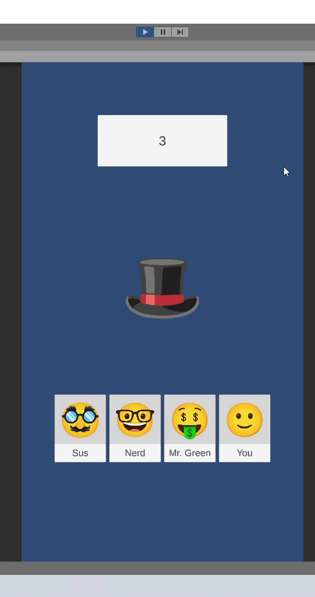
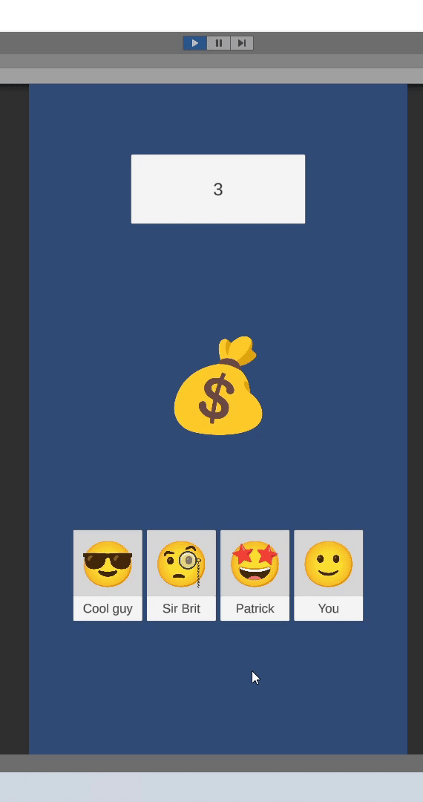
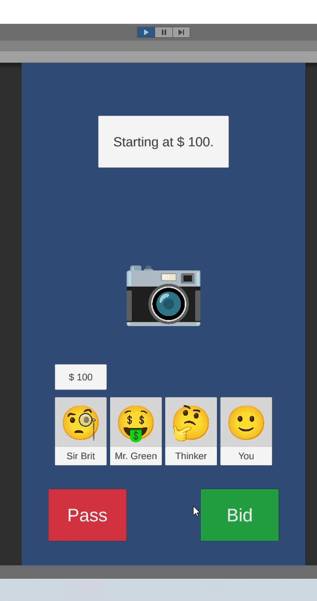

# unity-tz-bid-wars

## Description

This project demonstrates "bidding" gameplay mechanic as in [Bid Wars](https://play.google.com/store/apps/details?id=br.com.tapps.bidwars) game.

After submitting this project I got a feedback, actually, gameplay mechanic should work a little bit different.

I spent more time than expected to implement [gameplay logic](https://github.com/kukumberman/unity-tz-bid-wars/commit/4978f94b77320f866b7cfae3674fff8f0f81f7a5). Tried to keep it as simple as possible by using timers, coroutines, but then switched to separate states.

## Original task description

Створити геймплей бідінг-інтерфейсу в 2Д, екран вертикальний.

Маєш стартову ціну (100$)

Трьох конкурентів окрім тебе роблять ставки хто більше (кожен раз підвищуєш тільки на 25$), як на звиклому аукціоні, якщо після 3 секунд ніхто не перебив - анонсуєш того хто виграв. Для ШІ щоб зрозуміти чи перебивати гравця чи ні - зроби рандомно, але щоб весь процес не тривав довше 3 хвилин.

Дизайн можеш зробити любий найпростіший бо важлива сама механіка

## Showcase

<table>
  <tr>
    <td>
      
    </td>
   <td>
      
    </td>
   <td>
      
    </td>
  </tr>
</table>
